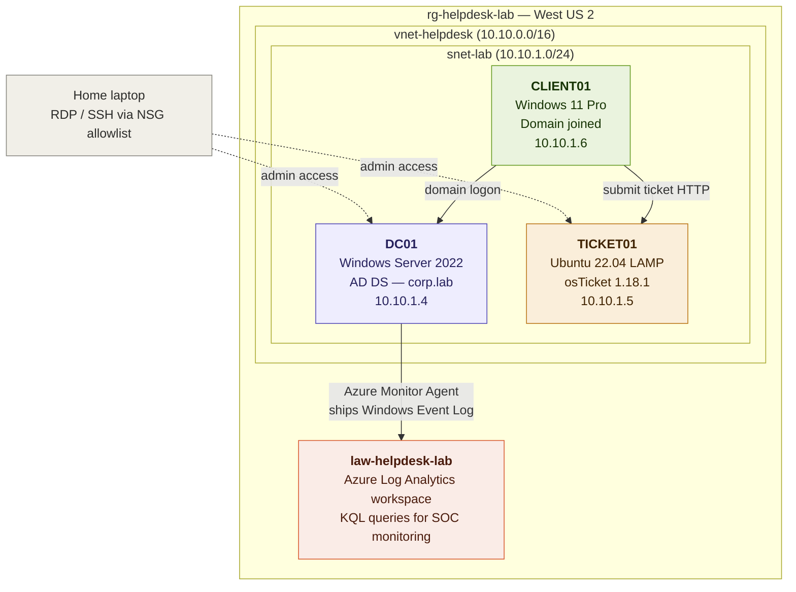
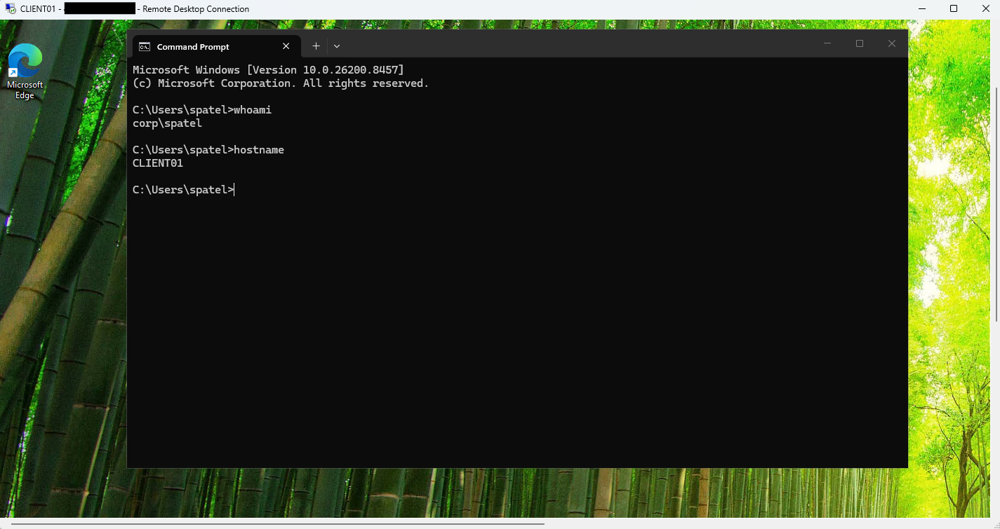

# Azure Help Desk Lab

This project documents the design, deployment, and operation of a small-business Help Desk environment hosted in Microsoft Azure. The lab simulates a working IT support and SOC monitoring environment built from scratch.

The objective was to:

- Build a functional Active Directory environment with realistic OU, group, and user structure
- Stand up a ticketing system mirroring the AD organizational layout
- Demonstrate end-to-end Tier 1 Help Desk workflows from end-user submission to technician resolution
- Configure Windows audit policy and ship security events to Azure Log Analytics for SOC-style monitoring

---

## Environment

- Microsoft Azure (Resource Group, Virtual Network, Network Security Group)
- Windows Server 2022 (Active Directory Domain Services)
- Ubuntu 22.04 LTS (Apache, MariaDB, PHP)
- Windows 11 Pro (domain-joined client)
- osTicket 1.18.1 (ticketing platform)
- Azure Log Analytics with Azure Monitor Agent (security event ingestion)
- ADUC, PowerShell (Active Directory module), KQL

---

## Architecture



---

## Domain Structure

| OU       | Security Group   | Users                                |
|----------|------------------|--------------------------------------|
| Helpdesk | HelpdeskAgents   | Maria Lopez, James Chen              |
| Sales    | SalesUsers       | Sarah Patel, David Nguyen            |
| IT       | ITAdmins         | Alex Johnson, Priya Singh            |

Domain: `corp.lab`
Default password for all test users: `TempPass123!`

---

## Key Findings

- Active Directory ships with `LockoutThreshold=0` by default, meaning accounts cannot be locked out without explicit policy configuration. A lockout policy (5 attempts, 15-minute duration) was applied as a baseline hardening step.
- `PasswordNeverExpires=$true` conflicts with `ChangePasswordAtLogon=$true`. The never-expires flag must be cleared first before forcing password change at next logon.
- Windows security events ingested via Azure Monitor Agent and Data Collection Rules land in the `Event` table (legacy Log Analytics agent schema), not the `SecurityEvent` table referenced in older documentation.
- KQL time filters such as `ago(1h)` can return empty results due to ingestion lag of 5 to 15 minutes; removing the time filter or extending the window is the practical workaround.
- Default Windows audit policy does not log most events relevant to SOC monitoring. `auditpol` configuration is required for Logon, Logoff, Account Management, Sensitive Privilege Use, and Directory Service Changes.

---

## Supporting Evidence

A representative screenshot from the build is included below. The full collection of build, ticket workflow, and SOC monitoring evidence is documented in the project writeup linked at the bottom.



---

## Tier 1 Help Desk Tasks Demonstrated

- Password reset (GUI and PowerShell)
- Account unlock (GUI and PowerShell)
- Security group membership add and remove
- User account disable and enable
- User move between organizational units

Each task was documented with both Active Directory Users and Computers (ADUC) and the equivalent PowerShell command, with corresponding Windows security events captured in Azure Log Analytics.

---

## SOC Monitoring Queries

Five documented KQL queries are included in `/scripts/soc-queries.kql`:

- Failed logon attempts (Event ID 4625)
- Password reset audit trail (Event ID 4724)
- Brute force detection (count of 4625 grouped by source)
- Security group membership changes (Event IDs 4728, 4732, 4756)
- Event type profile (summary of collected events with description)

---

## Repository Contents

```
azure-helpdesk-lab/
├── README.md
├── scripts/
│   ├── seed-corp-lab.ps1            PowerShell script to rebuild AD structure
│   ├── enable-audit-policies.ps1    auditpol configuration for SOC monitoring
│   └── soc-queries.kql              Five documented KQL queries
├── screenshots/
│   └── lab-evidence.png             Representative build evidence
└── docs/
    └── Tier1-HelpDesk-Practice-Guide.pdf
```

---

## Full Project Writeup

Detailed build documentation, demonstrations, and lessons learned are available here:

<https://rickjaimesdez.github.io/writeups/azure-helpdesk-lab/>
